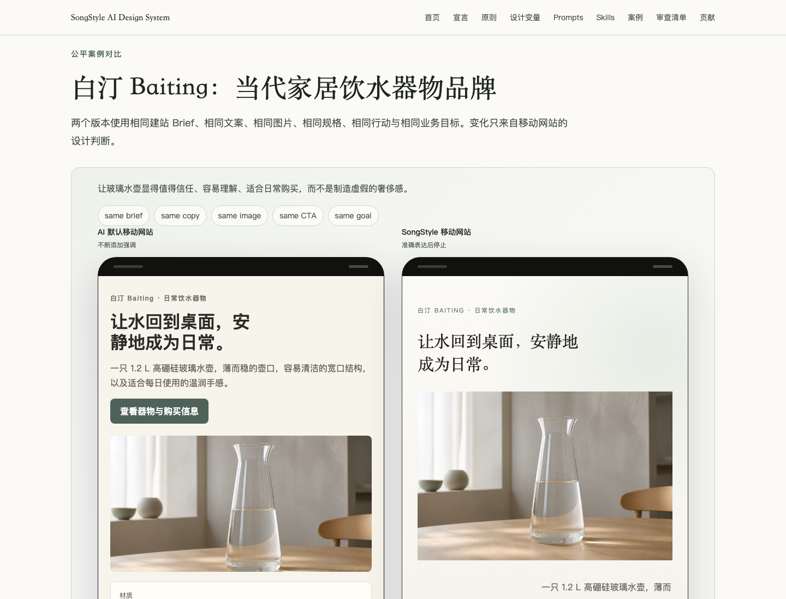

# SongStyle AI Design System

**宋式 AI 设计系统**

> AI 不懂得何时停止。
>
> 同样的建站内容，SongStyle 让移动网站从不断添加转向准确表达。

SongStyle AI Design System is an open-source design language for turning Song
aesthetics into modern UI, web, and app design decisions. It helps designers,
developers, and AI agents decide what should exist, how information should
relate, and where expression should stop.

宋式 AI 设计系统不是古风素材库，也不是把界面变得空旷。它将宋代美学中的格物致知、
三远法、宋版书排版、汝窑色彩、留白生意与器以载道，转译为现代移动网站和 Web UI
可以执行、审查和讨论的设计判断。

项目调研显示：宋代美学在室内、文创、建筑与展览中已有较多应用讨论，但在 UI、网页、
APP 与 AI 辅助数字设计中的系统性应用研究几乎空白。SongStyle 试图填补的正是这个空白。

[Website](https://robbyshao-8ag.github.io/songstyle-ai-design-system/) ·
[Prompts](https://robbyshao-8ag.github.io/songstyle-ai-design-system/prompts/) ·
[Agent Skills](https://robbyshao-8ag.github.io/songstyle-ai-design-system/skills/) ·
[Roadmap](ROADMAP.md) ·
[First-round user testing](docs/research/first-round-user-testing.md)

## 30 秒理解 SongStyle

SongStyle 不是把页面做空，而是先守住硬约束，再用近景、中景、远景建立秩序，最后才做留白、克制和余韵。

四层决策顺序：

1. **硬约束**：可访问性、中文标题可读性、必要内容、真实表述和清楚主行动不能被审美覆盖。
2. **任务目标**：页面首先服务用户任务和业务目标，不同场景允许不同信息密度。
3. **信息距离**：用近景、中景、远景组织即时任务、支持证据和品牌叙事。
4. **审美表达**：留白、克制、温润和余韵只能强化前三层，不能替代它们。

快速入口：[Quick Reference / 快速参考](docs/quick-reference.md)

## See The Difference / 先看差异

The ordinary AI and SongStyle versions use **the same brief, the same copy,
the same image, the same CTA, the same features, and the same goal**. The
content did not become better. The design judgment did.

普通 AI 与 SongStyle 版本使用相同建站要求、相同文案、相同图片、相同行动与相同目标。
变化只来自移动网站的版面、层级、字体、字号、色彩、材质、图片裁切、空间和停止时机。



[白汀 Baiting 移动网站对比](https://robbyshao-8ag.github.io/songstyle-ai-design-system/examples/lifestyle-brand/)


[清序 Qingxu 移动网站对比](https://robbyshao-8ag.github.io/songstyle-ai-design-system/examples/digital-product/)

## Digital SongStyle Framework / 数字宋式框架

- **格物致知 / Observed precision**: every visible element must be necessary, accurate, and carefully tuned.
- **三远法 / Information distance**: near, middle, and far distance become task, evidence, and narrative hierarchy.
- **宋版书 / Typographic rhythm**: composed line breaks, generous line-height, and sparse-dense rhythm shape reading.
- **汝窑与墨分五彩 / Color and tone**: porcelain, warm paper, mist gray, celadon, ink tones, and tiny accents replace high-saturation spectacle.
- **留白生意 / Functional breathing space**: negative space focuses, pauses, routes, and leaves room for imagination.
- **器以载道 / Useful ornament**: lines, textures, and shapes must serve grouping, routing, tactility, or meaning.

## Use It / 开始使用

- [从 Brief 生成 Web 设计](prompts/web-design/from-brief.md)
- [改写现有页面](prompts/web-design/rewrite-existing-page.md)
- [审查一个页面](prompts/design-review/review-page.md)
- [比较普通 AI 与 SongStyle](prompts/design-review/compare-default-and-songstyle.md)
- [SongStyle Web Designer Skill](skills/songstyle-web-designer/SKILL.md)
- [SongStyle Design Reviewer Skill](skills/songstyle-design-reviewer/SKILL.md)
- [Design Tokens / 设计变量](docs/foundations/design-tokens.md)
- [审查清单](checklists/songstyle-review.md)

## What It Is Not / 它不是什么

- 不是对宋代历史设计的复原
- 不是水墨、印章、传统纹样或书法字体的素材库
- 不是以删减可用信息换取视觉留白的风格模板
- 不是要求所有产品共享一套视觉皮肤

## Read And Participate / 阅读与参与

- [中文宣言](docs/manifesto/zh.md)
- [English Manifesto](docs/en/manifesto.md)
- [English Core Principles](docs/en/core-principles.md)
- [English Usage Guide](docs/en/usage.md)
- [Roadmap](ROADMAP.md)
- [首轮用户测试计划](docs/research/first-round-user-testing.md)
- [参与贡献](CONTRIBUTING.md)

## Project Status / 项目状态

`v0.1.0` has been released. Current work focuses on evidence, real-world
validation, and making SongStyle more operational for people and AI.

## Development / 本地开发

```bash
npm install
npm run dev
npm run verify
```

## Licenses / 许可证

Code and executable assets are licensed under the MIT License in
`LICENSE-CODE`. Documentation, examples, and visual case-study content are
licensed under CC BY 4.0 in `LICENSE-CONTENT`.
